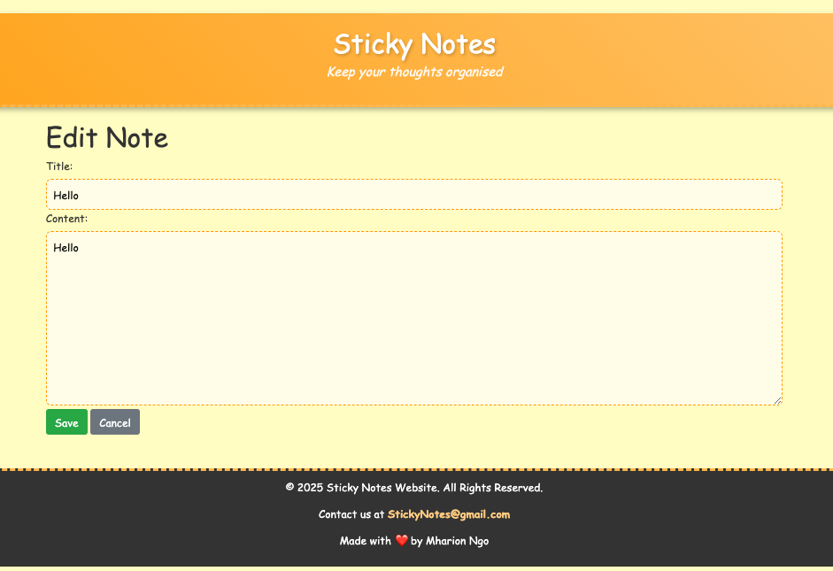

# Sticky Notes Project

## Description

The Sticky Notes project is a simple web application built using Django that allows users to create, edit, and delete notes online. It provides a user-friendly interface where users can manage their sticky notes efficiently. This project serves as a practical example of web development using Django and is an excellent resource for learning about web applications and database management. Understanding how to create web applications helps improve your coding skills and prepares you for real-world programming challenges.

## Table of Contents

- [Description](#description)
- [Installation](#installation)
- [Usage](#usage)
- [Screenshots](#screenshots)
- [Credits](#credits)

## Installation

To run the Sticky Notes project locally, you'll need to have Python and Django installed on your machine. Follow these steps:

1. **Clone the Repository**:
   ```bash
   git clone https://github.com/ngomharion04/Sticky_Notes_Website.git
   ```

2. **Navigate into the Project Directory**:
   ```bash
   cd repositoryname
   ```

3. **Set Up a Virtual Environment (Optional but recommended)**:
   ```bash
   python -m venv venv
   source venv/bin/activate  # On Windows use: venv\Scripts\activate
   ```

4. **Install Requirements**:
   Make sure you have the `requirements.txt` file in the repository. Install the required dependencies by running:
   ```bash
   pip install -r requirements.txt
   ```

5. **Run Migrations**:
   Set up the database by applying migrations:
   ```bash
   python manage.py migrate
   ```

## Usage

After installing the project and setting up the database, you can start the Django development server:

```bash
python manage.py runserver
```

Then, open your web browser and go to `http://127.0.0.1:8000/`. You'll be able to create, edit, and delete notes from the application.

### Features
- Create new notes with titles and content. You will also see the date and time the note was created at.
- Edit existing notes.
- Delete notes you no longer need.

## Screenshots

Below are some screenshots that showcase the functionality of the Sticky Notes application:

1. **Home Page**:
   
2. **Add New Note**:
   
3. **Edit Note**:
   


## Credits

This project was created by [Mharion](https://github.com/ngomharion04/). If you have any questions or feedback, feel free to reach out!
